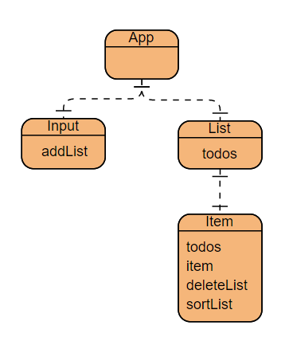

思路：
1. 确定本次作业需要的类型ITodo，包含属性id: string, content: string, finished: boolean, ctime: number, mtime: number。
2. 先划分组件，如下图，整体分为四个组件，首先是一个主组件APP，生成页面的主体部分，其中包括两个子组件分别是Input和List，Input负责添加条目，App向其传入addList方法；List负责生成整个清单。App向其中传入ITodo数组todos；List组件也有一个子组件Item，负责生成一个条目，需要向其中传入参数清单todos，便于修改todos中单个item的finished属性，以及deleteList，和sortList方法，实现子组件向父组件传递信息。
3. 为了减少不必要的渲染，使用React hooks优化组件，从以下两个方面入手：
    - 避免添加条目时，Input组件重新渲染，这里需要用到useCallback和React.memo，Input要与兄弟组件List进行通信，所以要向Input中传入函数addList，addList实现了todos增加item功能，用useCallback对传入Input的函数进行记忆，并用React.memo对Input进行记忆，这样当添加一个item时，Input组件不会重新渲染。
    - 避免修改item状态和删除item时，整个List组件重新渲染，这里也需要用React.memo对Item进行记忆，只有当传入的参数改变时，才会重新渲染item，所以，List组件向Item中传入的两个函数也要用useCallback进行记忆，这样当修改或删除单个item时，只有一个Item组件重新渲染。
4. 要实现item的排序，这里写了一个compare比较函数，当两个item的状态相同时，比较其ctime的大小，较大者排在前，当状态不同时，属性finished为false的item排在前；每次item发生变化时，都要重新对todos进行一次排序。
5. 用useState控制每个组件的渲染，App组件的渲染由len驱动，addList每次执行时，会执行setLen修改len为当前的todos.length，List组件的重新渲染由state驱动，每次删除或修改item的值会执行setState，对state的值进行修改，Item组件渲染由finish驱动，每次修改item的finished属性，就会执行setfinish对其进行更改，并且执行sortList向父组件List传递信息，以此List和Item组件都将重新渲染。
6. 在每个组件最开始添加了console.log()语句,可以**在控制台可以查看每次改动时哪些组件进行了渲染**
